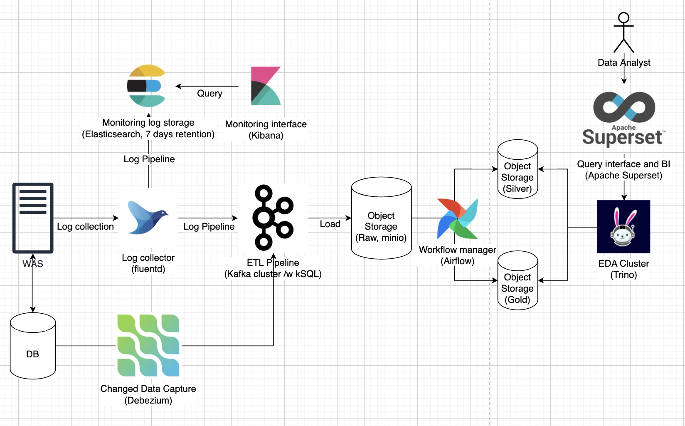

# data-platform-impl

나 혼자 데이터 플랫폼 구축하기

## 아키텍처

### 0단계

> 상황: 서비스용 WAS, DB 만 있는 상태. 로그 등을 수집했지만 사용하기 힘듦

문제점
- 조회쿼리를 돌리려면 현재 존재하는 데이터베이스에서 집계 쿼리를 돌려야 함
  - 프로덕션 서비스 DB에 부하(장애 우려)
- 로그 모니터링 시스템 없음

### 1단계

> 상황: 데이터 기반의 의사결정을 위해 데이터 분석이 필요한 상황. 데이터 분석할 도구가 없어 도입 필요

**프로덕션 서비스 DB, 로그 스토리지의 데이터를 일일 배치 처리로 가공된 데이터를 조회할 수 있도록 인프라 구축**

- 쿼리 엔진과 저장소 분리
  - 실시간 로그 파이프라인 구축
    - WAS 가 container application 으로 가정
    - docker driver 인 `fluentd` 사용 
      - `K8S` 로 확장할 경우 추가적인 리서치 필요
    - 뒷단에서 log buffer 역할을 수행할 `Kafka`, `kSQL` 사용
      - `ksqlDB` 가 `elasticsearch`, `kibana` 를 대체할 수 있다면 적용 시도
  - SSOT 구축(Data Lake)
    - `minio` 사용 (Cloud object storage compatiblity)
  - 쿼리 엔진 구축
    - `Trino` 사용
  - 실시간이 필요하지 않은 데이터는 Workflow manager 로 ingestion
    - `Apache Airflow` 사용
  - 저장하고 있던 로그 저장소 backfill
    - Dump 필요

문제점
- 실시간 데이터 조회 불가능. 무조건 배치 데이터만 조회 가능
- 데이터 엔지니어의 개입이 필요한 테이블 입수작업, 배치 작업

### 2단계

> 상황: 실시간 데이터 분석 필요성과 분석 엔진 효율성 필요

**데이터 분석 효율성 - 실시간 데이터를 바로 처리하여 즉시 활용할 수 있도록 인프라 구축**

- CDC
- ETL, EDA 클러스터 오토 스케일링
  - ETL 클러스터의 시스템 리소스의 지속적인 모니터링 필요
    - 효율적인 인스턴스 타입 선택을 위함
  - 컨테이너 기반, K8S 도입

문제점
- 아직까지 데이터 엔지니어의 개입이 필요한 테이블 입수작업, 배치 작업

### 3단계

> 상황: 프로덕트가 성장 및 확장하여 테이블이 증가하였지만 수동적인 입수 작업 존재

**자동화 - 데이터 프로덕트 개발**

- 추가적인 테이블 입수 작업 및 배치 작업을 데이터 엔지니어 개입 없이 가능

### 4단계

> 상황: 머신러닝 엔지니어 및 데이터 사이언티스트의 추가로 머신러닝 요구사항 추가

- 머신러닝 도입, 모델 서빙
- MLOps, Kubeflow / MLflow

## 참고
- https://www.youtube.com/watch?v=6CZwKUp1ozw&ab_channel=%ED%86%A0%EC%8A%A4
- https://www.youtube.com/watch?v=rH_xJBoRuZE&t=2302s&ab_channel=%EC%9A%B0%EC%95%84%ED%95%9CTech
- https://www.youtube.com/watch?v=lzV9ujbsZFg&ab_channel=Amplitude
